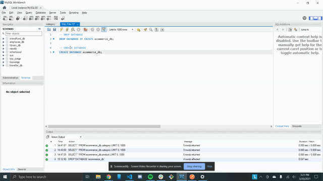
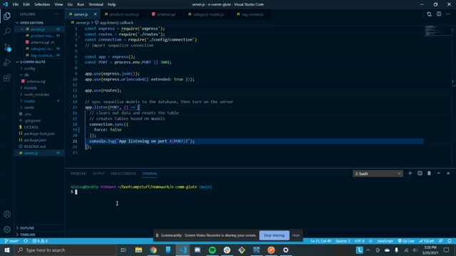
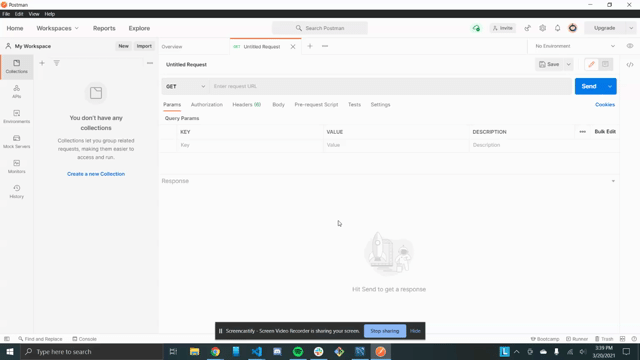
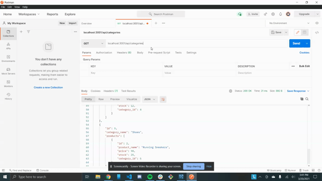

# e-comm-glute
For this project I created a database and CRUD routes to create, update and delete information on the database. 

## Description
We were tasked to create a backend for an e-commerce site. At first I was pretty intimidated, but once I got in there the task was less intimidating than I originally thought. 

The routes came together pretty quickly once I started and I was excited to see them working in postman. 

As I was doing this homework, how I was supposed to call the responses from the database finally clicked. I've felt like I'm stumbling around for a few weeks, so I was very relieved once that started making sense. 

## Technologies Used
Javascript  
[Postman](https://www.postman.com/)  
[mySQL](https://www.mysql.com/)  

## Video Walkthroughs
### Creating the Database
    

### Seeding the Database
   

### Starting the Server
   

### All Get Routes for Tags, Products, and Categories
    

### Get Routes by ID for Tags, Products, and Categories
  

### Post, Put, and Delete Routes for Products  
  

### Post, Put, and Delete Routes for Tags  
   

### Post, Put, and Delete Routes for Categories  
  

## License Info
[MIT LICENSE](LICENSE)

## Credits 
Special thanks to [Brandon Haley](https://github.com/Kyle7286) and [Heather Smith](https://github.com/sorengrey) for studying with me on this one.  

## Links
[Repo](https://github.com/a-andres1/e-comm-glute)  

## Contact Info
[email me](mailto:alyssaandres1@gmail.com)  
[find me on github](https://github.com/a-andres1)